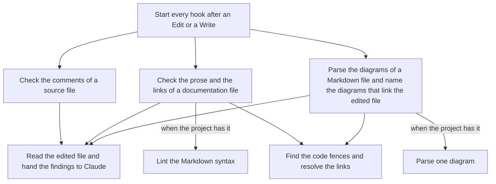

# Hooks

What happens after Claude edits a file?

| Element | Source |
| --- | --- |
| `hooksJson` | [`hooks.json`](hooks.json) |
| `checkComments` | [`check-comments.mts`](check-comments.mts) |
| `checkDocs` | [`check-docs.mts`](check-docs.mts) |
| `checkDiagrams` | [`check-diagrams.mts`](check-diagrams.mts) |
| `markdown` | [`lib/markdown.mts`](lib/markdown.mts) |
| `hook` | [`lib/hook.mts`](lib/hook.mts) |

Every hook informs and never blocks an edit. A hook that has nothing to report prints nothing.

- [markdownlint](https://raw.githubusercontent.com/DavidAnson/markdownlint/main/README.md) and [Mermaid](https://raw.githubusercontent.com/mermaid-js/mermaid/develop/docs/config/usage.md) come from the project that is edited, never from this plugin.
- [Claude Code hooks](https://code.claude.com/docs/en/hooks.md) describes the input a hook reads and the output it writes.
