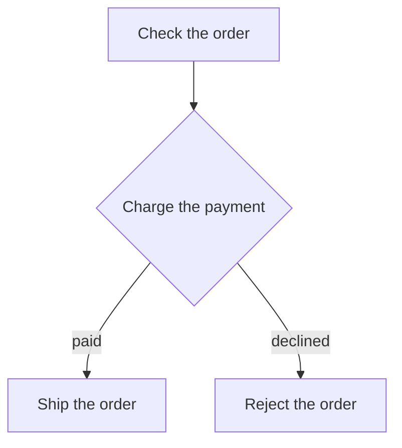
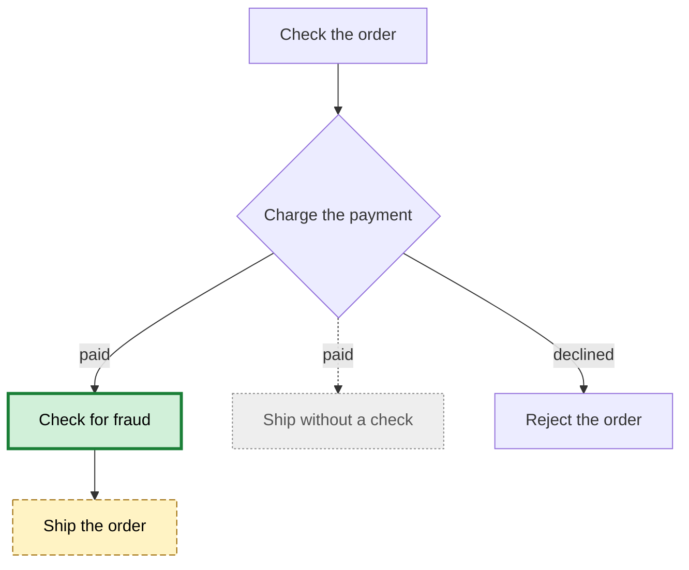

Rules for every diagram you draw or touch. A diagram answers one question about a flow or a structure faster than the code or a page of prose does. It is a `mermaid` code block in Markdown. The text is the only source, so a person reads the picture and an agent reads the block. GitHub, VS Code and JetBrains render it without a build step.

## Steps

1. **Decide whether a diagram helps.** A flow or a structure you explain is a diagram. A single step or a single relation, such as one function that calls another, has nothing to connect and stays a sentence. The steps a reader follows in a how-to stay a numbered list. Values the reader looks up stay a table. When you explain a flow or a structure in chat, draw it without being asked.
2. **Name the question.** One diagram answers one question, written as one sentence in the language of the surrounding document, or of the conversation in chat. A second question is a second diagram.
3. **Pick the type.** Take it from [Types](#types) by the question. Another type only when the user asks for it.
4. **Read the code.** Every element of a diagram of the current state exists in the code. Every edge is a call, a transition or a relation you read there. What you did not read is left out, never guessed. A diagram of something that is not built yet is a [planned state](#planned-state).
5. **Draw.** Every line follows [Form](#form). A diagram the reader cannot take in at a glance is split. The overview keeps the main path and folds each group of steps into one element. Every folded group gets a diagram of its own.
6. **Link the elements.** Put the table of [Sources](#sources) under the diagram.
7. **Place it.** The file follows the `project-docs` skill. An existing structure of the project wins.
   - A diagram of the whole project, such as its architecture, its data model or a process across features, lives in `docs/<topic>.md`.
   - A diagram of one flow or one feature lives in the `README.md` of the folder that holds its code, such as `src/orders/README.md`. GitHub shows that file when the reader opens the folder.
   - Code that has no folder of its own sends the diagram to `docs/<topic>.md`.
   - A detail diagram lives in the `README.md` of the subfolder it describes. The overview links it from its table.
8. **Show it.** A terminal prints a `mermaid` block as text. Write every diagram you show in chat into `$TMPDIR/diagrams/<topic>.md` as well, outside the repository, and name the path. The user opens it in the Markdown preview of the IDE.

Done when every diagram names its one question, takes the type of that question, shows only what the code holds, links each element to its source, sits where the reader looks for it, and parses without an error.

## Types

| The reader asks | Type | Instead |
| --- | --- | --- |
| What happens in which order, and where does it branch? | `flowchart` | |
| Who is responsible for which step? | `flowchart` with one `subgraph` per role | `sequenceDiagram` when the messages matter more than the work |
| Who talks to whom, and when? | `sequenceDiagram` | |
| Which states does it pass through? | `stateDiagram-v2` | `flowchart` when the nodes are actions |
| How does the data relate? | `erDiagram` | `classDiagram` when behaviour or inheritance matters |
| How do the types relate? | `classDiagram` | `flowchart` for plain dependencies between modules |
| What is the system made of? | `architecture-beta` | |
| When does what happen? | `timeline`, `gantt` for durations, `gitGraph` for branches | A list, unless time is the question |
| How is it divided? | `mindmap` | `flowchart` once the parts link across |

The same question takes the same type inside the code, around it and in the domain. A control flow, a CI pipeline and an order process are all a `flowchart`.

`architecture-beta` is a beta type of Mermaid. Its icons are `cloud`, `database`, `disk`, `internet` and `server`, and it takes no `classDef`.

## Form

- The first line after the keyword is `accTitle`, followed by the question of step 2. A type that knows no `accTitle`, such as `mindmap`, `sankey-beta` and `block-beta`, takes the question as `title` in its front matter.
- An ID is the name the element has in the code, in lowerCamelCase, such as `checkOrder`. Never a single letter and never `end`.
- A label says what happens in the words of the domain, a step with its verb first, such as `"Charge the payment"`. It stands in double quotes and in the language of the surrounding document.
- Every branch of a decision carries its condition as the label of its edge.
- A `flowchart` runs `TD`. A pipeline without a branch runs `LR`.
- Declare the elements in reading order, so the edges cross as little as possible.
- A comment is `%%` on a line of its own.
- Meaning stands in the text. A colour or a shape alone never carries it.
- Only the syntax of the Mermaid version that [Mermaid](#mermaid) names. No `click`, no icon, no `%%{init}%%`, no `config` in the front matter and no ELK layout. Every renderer applies its own theme and layout, so nothing depends on where an element lands.

## Sources

The table stands right under the diagram, with only a blank line between them. It has one row per element that exists in the code, a node, a participant, a state, an entity, a class or a service. The first cell is the ID as the diagram writes it. The second cell is a relative link to the file, with the symbol as its text. An element that folds a group links the `README.md` that holds its detail diagram.

````markdown


| Element | Source |
| --- | --- |
| `checkOrder` | [`checkOrder`](checkout.ts) |
| `chargePayment` | [`chargePayment`](payment.ts) |
| `shipOrder` | [`shipOrder`](checkout.ts) |
| `rejectOrder` | [`rejectOrder`](checkout.ts) |
````

`timeline`, `gantt`, `gitGraph`, `journey` and `mindmap` take no table, because no file stands behind their elements.

## Planned state

A planned state is a sketch of something that is not built yet, or the effect of a change the user considers. It helps the user decide before the code changes.

- It goes into the chat, as step 8 shows it, and into the issue or the pull request that carries the change, as the `issue` and `pull-request` skills place it. The documentation shows what exists. A planned state enters it only on the user's word, under a `> [!NOTE]` that calls it a draft.
- It takes no table of sources, because its new elements have no file yet.
- A change is one diagram of the future state. Every element the change touches takes one of the classes `added`, `changed` and `removed`. A removed element stays in the diagram, and the edges to it are dotted. The three `classDef` lines close the diagram as written below.
- Under the diagram stands the legend as one sentence, then one bullet per consequence, such as a caller, a table, a test or a document the change also touches.
- Only the four types of the table below take a `classDef`. In every other type, such as `sequenceDiagram` and `architecture-beta`, the change is two diagrams, the current state under **Before** and the future state under **After**.

````markdown


A thick border is added, a dashed border is changed, a dotted grey border is removed.

- `shipOrder` waits for the fraud check, so an order ships later.
- The tests of `checkout.ts` cover the direct path and need the new one.
````

| Type | An element takes a class as |
| --- | --- |
| `flowchart` | `checkFraud["Check for fraud"]:::added` |
| `stateDiagram-v2` | `class Checked added` |
| `classDiagram` | `class FraudCheck:::added` |
| `erDiagram` | `FRAUD_CHECK:::added` |

## Update

A diagram in the repository is true for the current code. Bring it up to date when the user asks, when the hook reports `path:line linked` after an edit, and when the `pull-request` skill asks for the files of a branch.

1. **Find the diagrams.** The hook names the ones in a `README.md` above the changed file and under `docs/`. For a diagram anywhere else, and without the hook, search the Markdown files for links to each changed file with `grep -rn --include='*.md' -F '<file name>' .` and keep the hits that stand in a table under a `mermaid` block.
2. **Read the code again**, as step 4 of [Steps](#steps) does.
3. **Change what differs**, in the diagram and in its table. An element whose file is gone leaves both.
4. **Report.** Show the old and the new block as a diff. A diagram that still holds is named as unchanged.

## Mermaid

GitHub, VS Code and JetBrains each ship their own Mermaid, and the oldest of the three decides what a diagram may use. That version is 11.15.0. The hook checks the syntax with the Mermaid of the project, so the project pins exactly that version. If a project with a `package.json` has no `mermaid`, install it after confirmation with the "Add dev dependency" command of the `package-manager` skill.

```sh
pnpm add -D --save-exact mermaid@11.15.0
```

- [Mermaid syntax reference](https://raw.githubusercontent.com/mermaid-js/mermaid/develop/docs/intro/syntax-reference.md)
- [Mermaid accessibility options](https://raw.githubusercontent.com/mermaid-js/mermaid/develop/docs/config/accessibility.md)
- [GitHub, creating diagrams](https://docs.github.com/en/get-started/writing-on-github/working-with-advanced-formatting/creating-diagrams.md)

## Hook feedback

A PostToolUse hook parses every `mermaid` block of an edited Markdown file with the Mermaid of the project. When it reports `path:line syntax` with the message of the parser, fix each reported line in your next edit. A project without Mermaid gets no syntax check. After an edit to any file, the hook reports `path:line linked` for each diagram whose table links that file. Run [Update](#update) on each of them. In a project that has Mermaid, silence means every diagram parses. The rules above still apply.
