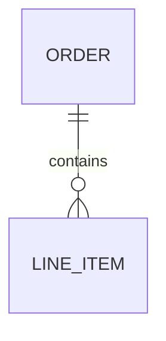

# Docs

Which tables does the shop store?

```mermaid
erDiagram
  accTitle: Which tables does the shop store?
  ORDER ||--o{ LINE_ITEM : contains
```

| Element | Source |
| --- | --- |
| `ORDER` | [`orders`](schema.sql) |
