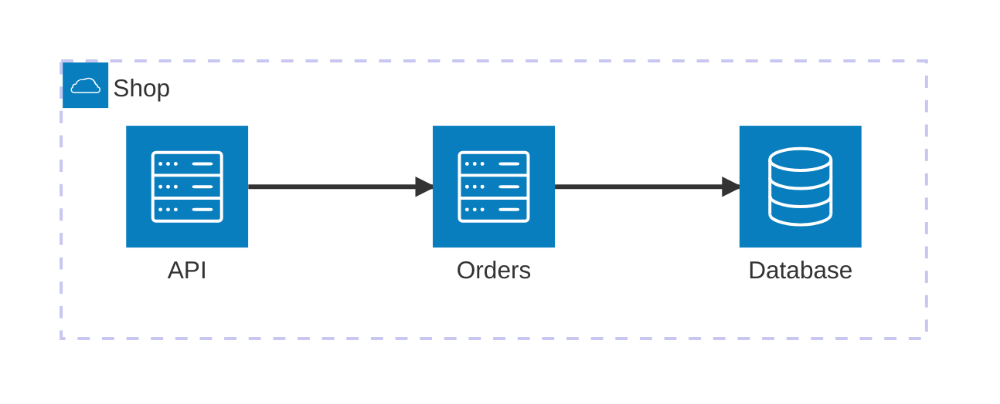

# Architecture

Which services does the shop consist of?

```mermaid
architecture-beta
  accTitle: Which services does the shop consist of?
  group shop(cloud)[Shop]
  service api(server)[API] in shop
  service orders(server)[Orders] in shop
  service db(database)[Database] in shop
  api:R --> L:orders
  orders:R --> L:db
```

| Element | Source |
| --- | --- |
| `orders` | [src/orders](../src/orders/checkout.ts) |
