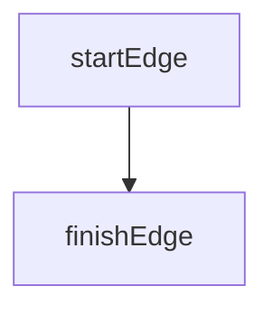
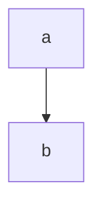
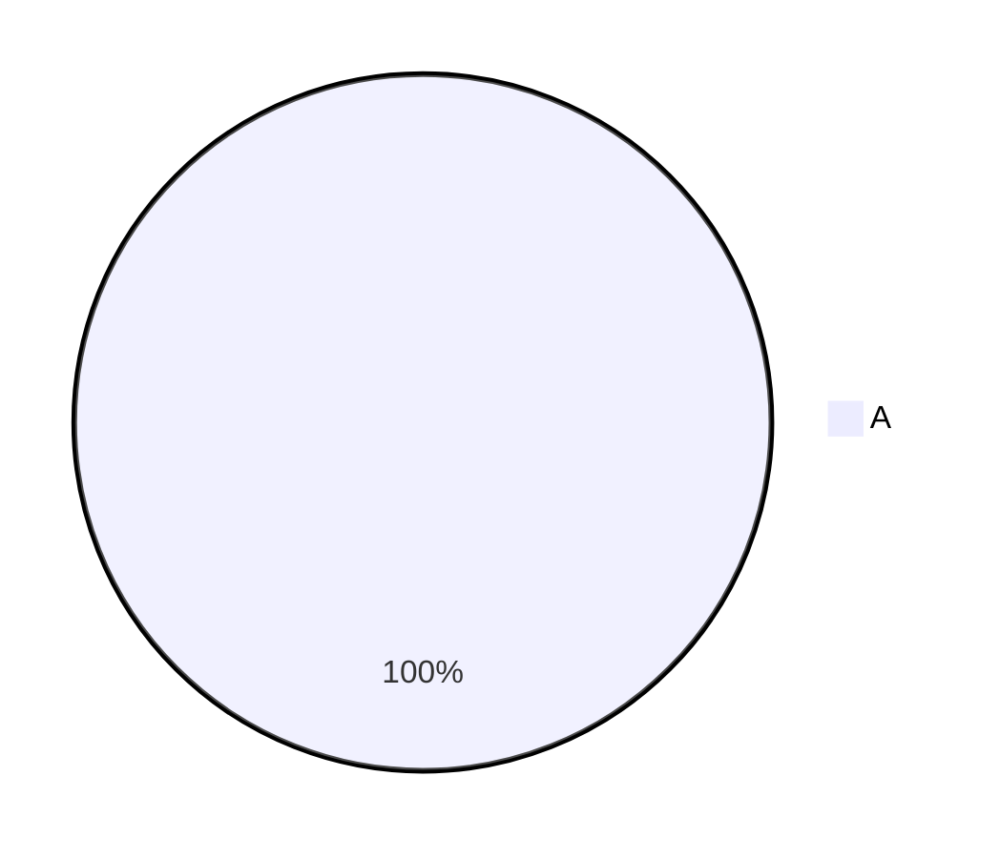
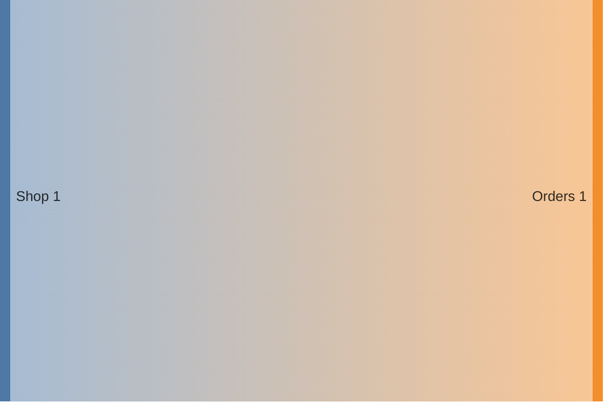
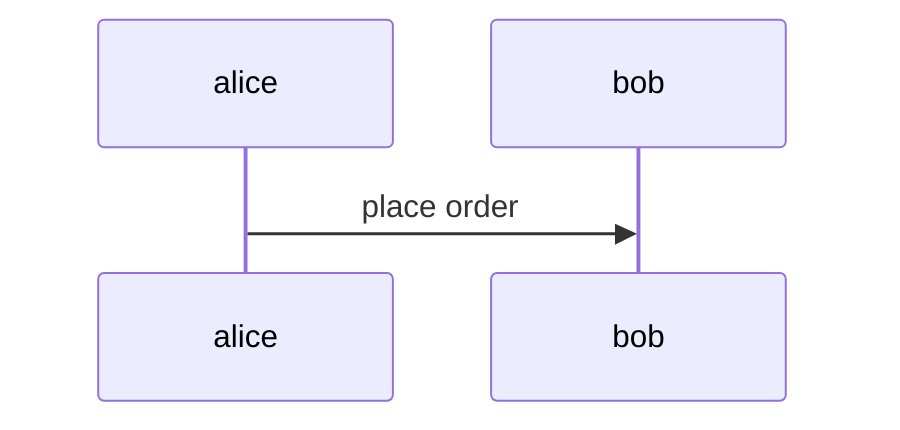
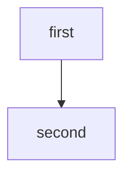

# Edge cases

Which layouts of a diagram and its table does the hook still read?



Element | Source
--- | ---
startEdge | [`start`](../src/orders/edge.ts)



| not a table


| Element | Source |
| --- | --- |
| | [`start`](../src/orders/edge.ts) |





> ```mermaid
> flowchart TD
>   accTitle: Which steps run?
>   quoted --> done
> ```
>
> | Element | Source |
> | --- | --- |
> | `quoted` | [`start`](../src/orders/edge.ts) |



| Element | Source |
| --- | --- |
| `alice` | [`start`](../src/orders/edge.ts) |
| `bob` | [`start`](../src/orders/edge.ts) |



Something | else
---
