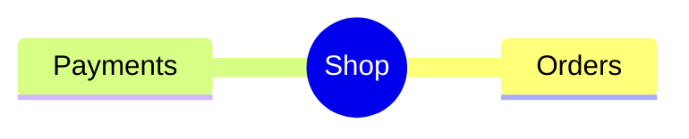
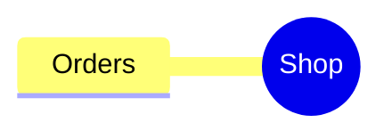
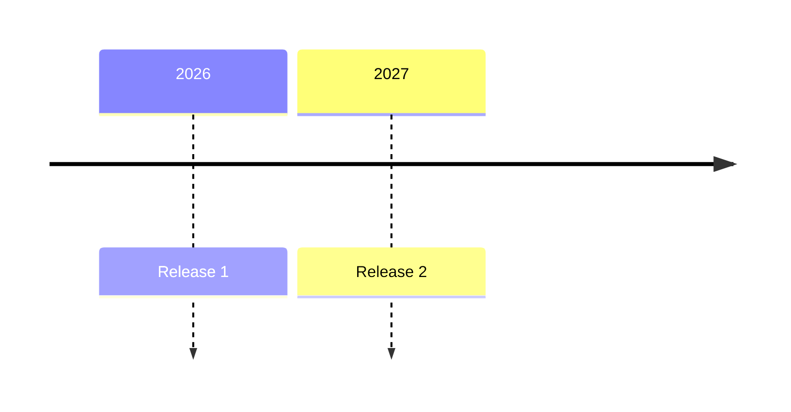
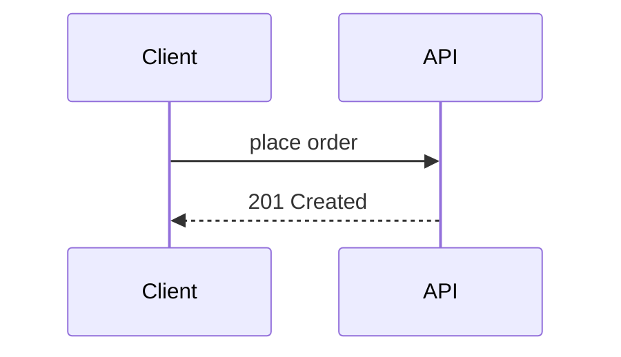
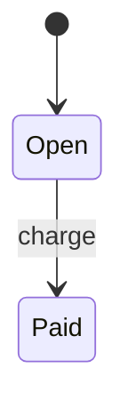
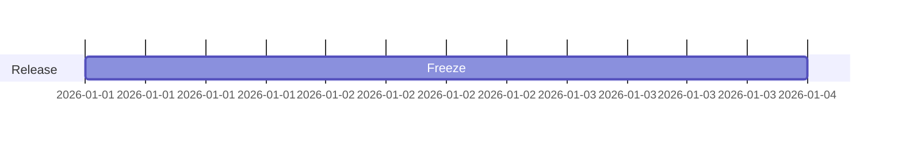

# Types

Which rules does each diagram type follow?

```mermaid
---
title: How is the shop divided?
---
mindmap
  root((Shop))
    Orders
    Payments
```

```mermaid
mindmap
  root((Shop))
    Orders
```

```mermaid
timeline
  accTitle: When did each release ship?
  2026 : Release 1
  2027 : Release 2
```

```mermaid
sequenceDiagram
  accTitle: Who talks to whom when an order is placed?
  participant client as Client
  participant api as API
  client->>api: place order
  api-->>client: 201 Created
```

| Element | Source |
| --- | --- |
| `api` | [`checkOrder`](../src/orders/checkout.ts) |

```mermaid
stateDiagram-v2
  accTitle: Which states does an order pass through?
  [*] --> Open
  Open --> Paid: charge
```

A sentence where the table belongs.

```mermaid
gantt
  dateFormat YYYY-MM-DD
  section Release
  Freeze :a1, 2026-01-01, 3d
```
