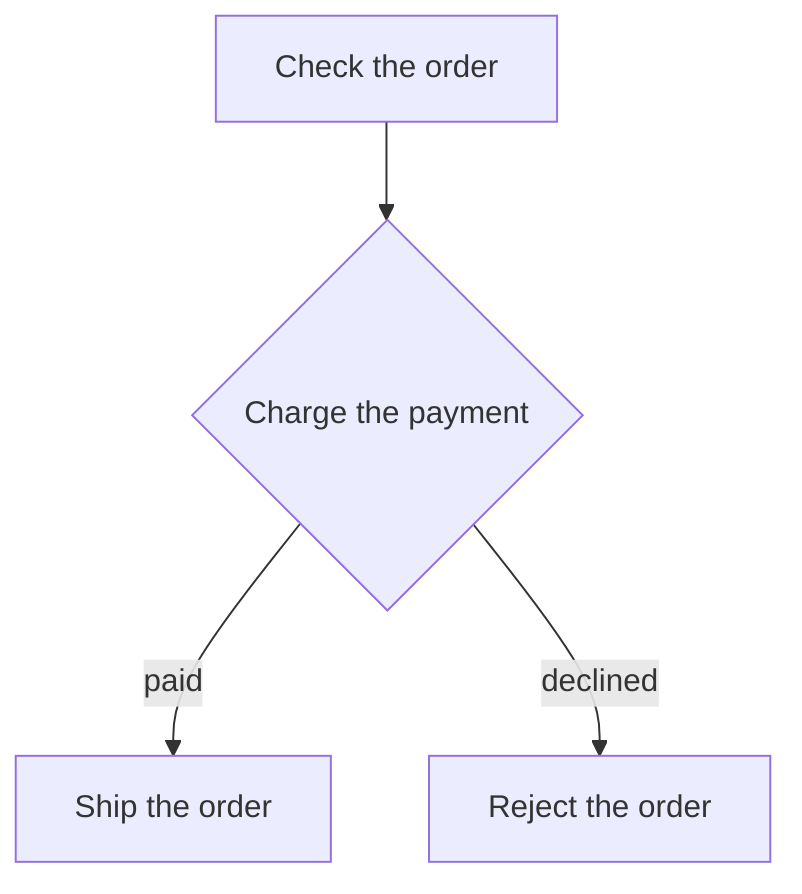

# Orders

How does an order get from the cart to the warehouse?

| Element | Source |
| --- | --- |
| `checkOrder` | [`checkOrder`](checkout.ts) |
| `chargePayment` | [`chargePayment`](payment.ts) |
| `shipOrder` | [`shipOrder`](checkout.ts) |
| `rejectOrder` | [`rejectOrder`](checkout.ts) |
